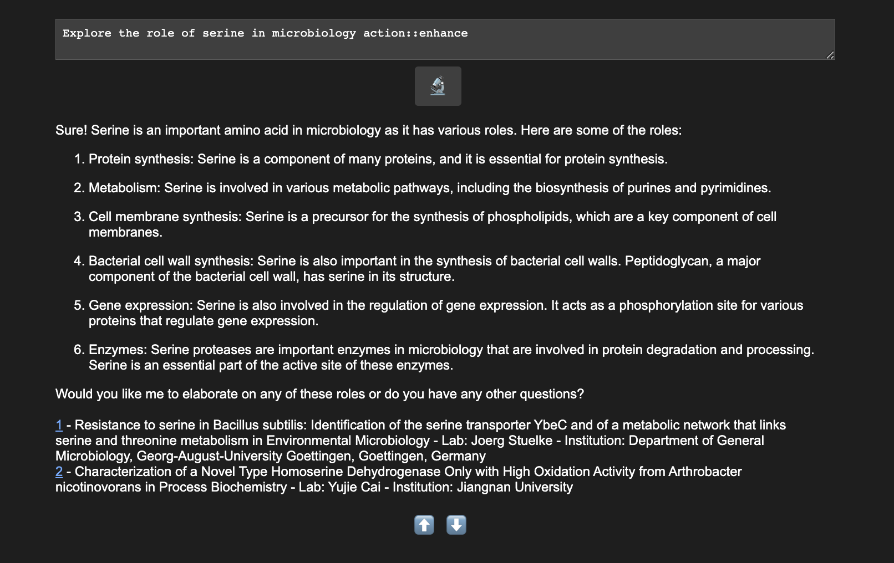

# Introducing science.pal: A Large Language Model (LLM) Research Companion

science.pal is an innovative application leveraging the power of large language models (LLMs) to help researchers streamline their scientific endeavors. It enables them to find relevant literature, generate research ideas, and much more with ease.

### Key Features:

- Dynamic LLM Type and Parameter Selection
-- Tailor the LLM to suit your research needs by selecting appropriate types and parameters.

- Automatic Paper Proposal
-- Get assistance in generating paper proposals and ideas for your research.

- Context-Aware Assistance
-- science.pal understands the context of your research, whether it's microbiology or cancer, and scopes the model accordingly.

- Prompt Enhancement via Small Molecule Knowledge Graph
-- Improve the quality of prompts with the integration of a small molecule knowledge graph.

### Upcoming Features:

- Wider Knowledge Graph Integration
-- Dynamically connect Metabolites, Pathways, and Proteins for a range of model organisms.
Larger Context Support

- Upload text or link external resources to provide additional context.
-- Connect your paper, PowerPoint, or research proposal, and SciencePal will thoughtfully take into account the objectives of your work when providing responses.
-- To connect your entire research corpus, check out the ChatGPT Retrieval Plugin: https://github.com/openai/chatgpt-retrieval-plugin

Note: Future development will focus on deeper Natural Language Processing (NLP) techniques and Model-First design principles to further enhance the application's capabilities. This development will continue in a private repository after the waitlist starts. The public repository will remain available for reference.

## Sneak peak:

Stay posted for more :-)

For more info reach out to: philipp.warmer@gmail.com, leave an issue here on git or ping me on [Linkedin](https://www.linkedin.com/in/philippwarmer/) 
